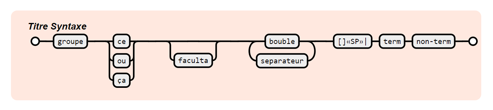
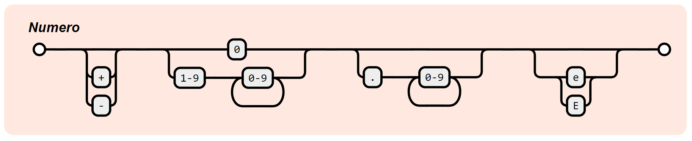
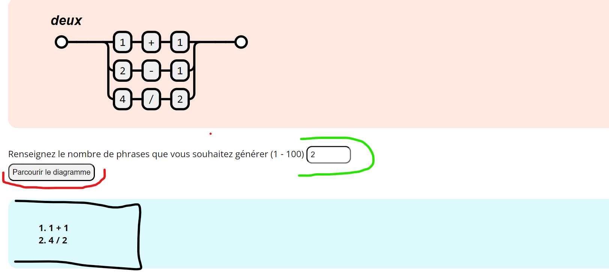
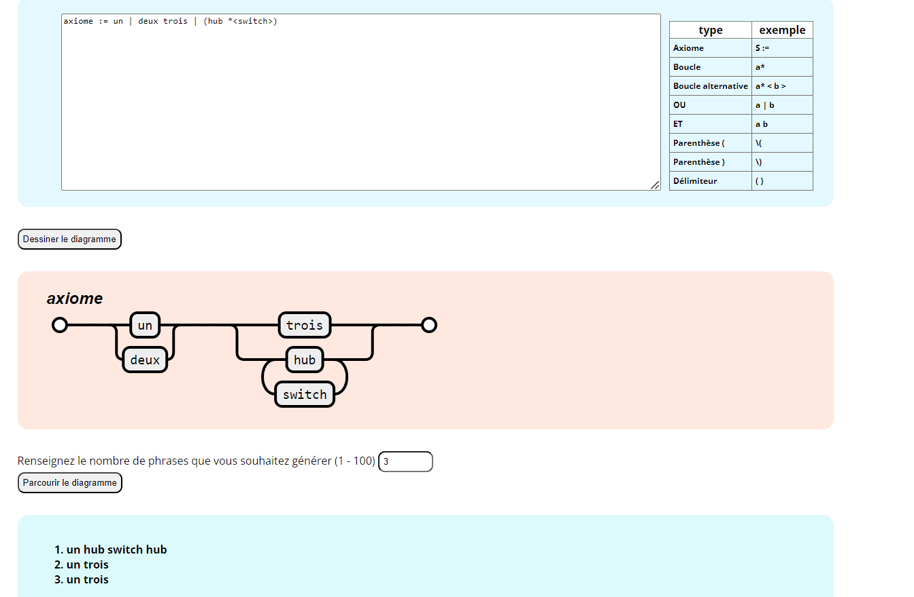

# Créateur de diagramme de syntaxe 🤽

Créez des diagrammes de syntaxe vectoriels à l'aide de RaphaëlJS.
Inspiré par [http://www.json.org/](http://www.json.org/).

## Examples
    Titre\ Syntaxe :=    # commentaire de ligne
        (groupe)
        ce|ou|ça
        [faculta]
        bouble*<separateur>
        \[\]\ \|        # caractères spéciaux d'échappement
        "term"
        non-term

    Numero := ["+"|"-"] ("0"|(1-9 0-8*)) ["." (0-9)*] [("e"|"E")))

## Usage

    - Apres avoir renseigné le graphe
    - Renseignez le nombre de phrases que vous souhaitez générer
    - Appuyer sur le bouton Parcourir le graphe
    - Visualisez le resultat👌

### Recap

## Licence
Open source

## Professeur : 
    M. KONANKAN

## Etudiants
    - BINI Aladji Kassoum
    - KONAN Kouadio Aimé Junior Stéphane
    - MEDA Kechiedou Luis-Borges Dégrize

